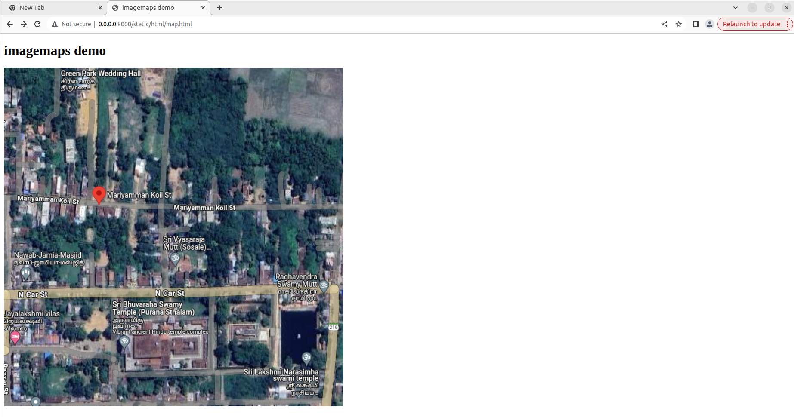
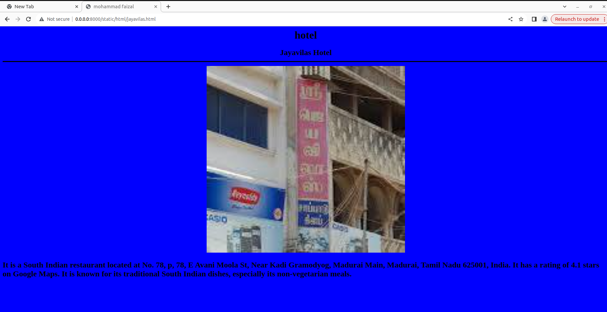
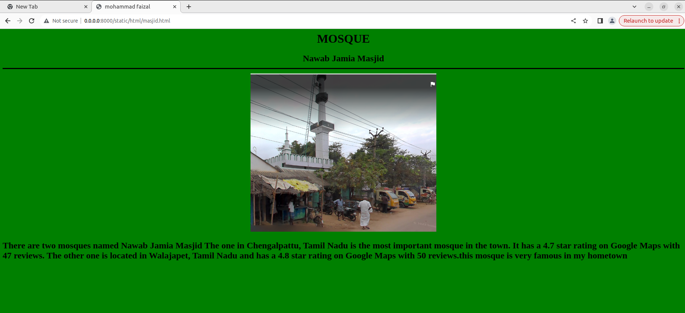
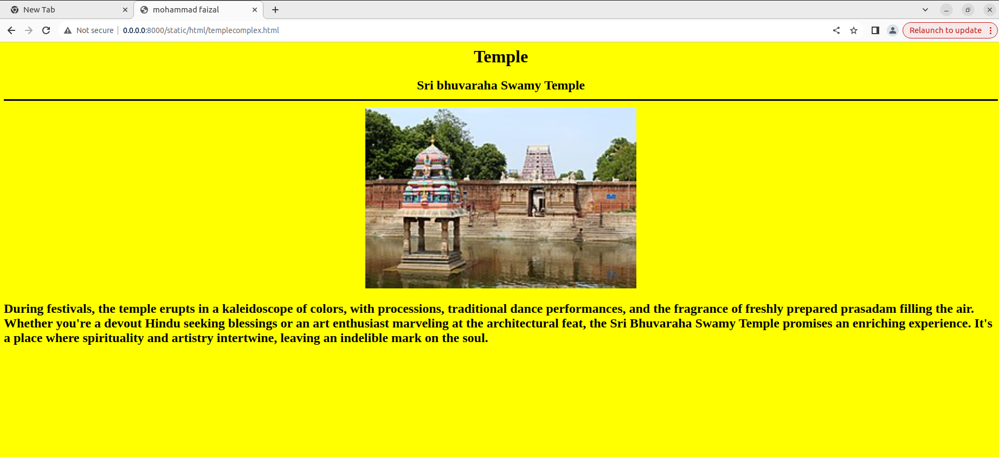

# Places Around Me
## AIM:
To develop a website to display details about the places around my house.

## Design Steps:

### Step 1:
clone the github repository into the IDE

### Step 2:
create a django project

### step 3:
write the needed HTML code

### step 4:
run the django server and excute the HTML files

## Code:
### map.html code:
```html
<!DOCTYPE html>
<html>
    <head>
        <title>
            imagemaps demo
        </title>
    </head>
    <body>
        <h1> imagemaps demo</h1>
        
        <map name="image_map">
            <area alt="masjid" title="masjid" href="masjid.html" coords="32,461,63,504" shape="rect">
            <area alt="vyasarajamutt" title="vyasarajamutt" href="vyasarajamutt.html" coords="378,425,405,468" shape="rect">
            <area alt="jayavilas" title="jayavilas" href="jayavilas.html" coords="37,598,50" shape="circle">
            <area alt="templecomplex" title="templecomplex" href="templecomplex.html" coords="293,629,42" shape="circle">
            <area alt="raghavendramutt" title="raghavendramutt" href="raghavendramutt.html" coords="749,498,33" shape="circle">
        </map>
    </body>
</html>
```
### jayavilas.html code:
```html
<html>
<head>
<title>mohammad faizal</title>
</head>
<body bgcolor="blue">
<h1 align="center">
<font color="black"><b>hotel</b></font>
</h1>
<h2 align="center">
<font color="black">Jayavilas Hotel</font>
<hr size="3" color="black">

<p align="justify">
<font face="Jayavilas Hotel" size="5">
<font color="black">
<h3>
<font color="black">
    It is a South Indian restaurant located at No. 78, p, 78, E Avani Moola St, Near Kadi Gramodyog, Madurai Main, Madurai, Tamil Nadu 625001, India.
It has a rating of 4.1 stars on Google Maps.
It is known for its traditional South Indian dishes, especially its non-vegetarian meals.
</font>    
</h3>
</font>
</p>
</body>
</html>
```
### masjid.html code:
```html
<html>
<head>
<title>mohammad faizal</title>
</head>
<body bgcolor="green">
<h1 align="center">
<font color="black"><b>MOSQUE</b></font>
</h1>
<h2 align="center">
<font color="black">Nawab Jamia Masjid</font>
<hr size="3" color="black">

<p align="justify">
<font face="Nawab Jamia Masjid" size="5">
<font color="black">
<h3>
<font color="black">
    There are two mosques named Nawab Jamia Masjid

The one in Chengalpattu, Tamil Nadu is the most important mosque in the town. It has a 4.7 star rating on Google Maps with 47 reviews.
The other one is located in Walajapet, Tamil Nadu and has a 4.8 star rating on Google Maps with 50 reviews.this mosque is very famous in my hometown
</font>    
</h3>
</font>
</p>
</body>
</html>
```
### raghavendramutt.html code:
```html
<html>
<head>
<title>mohammad faizal</title>
</head>
<body bgcolor="darkgreen">
<h1 align="center">
<font color="black"><b>MUTT</b></font>
</h1>
<h2 align="center">
<font color="black">Sri Raghavendra Mutt</font>
<hr size="3" color="black">

<p align="justify">
<font face="Sri Raghavendra Mutt" size="5">
<font color="black">
<h3>
<font color="black">
    Sri Raghavendra Mutt, a beacon of devotion dedicated to the revered Madhva saint, Guru Raghavendra Swamy.
     Believed to be the very house where the Saint resided during his visits to Srimushnam, the Mutt exudes a timeless charm.
      Its red-tiled roof and ochre walls echo the history of a thousand prayers whispered within its hallowed halls. Inside, a serene idol of Guru Raghavendra, adorned with vibrant garlands, presides over the devotees seeking his blessings. The air hums with the chants of hymns and the fragrance of incense, creating an atmosphere of tranquility and spiritual upliftment.
</font>    
</h3>
</font>
</p>
</body>
</html>
```
### templecomplex.html code:
```html
<html>
<head>
<title>mohammad faizal</title>
</head>
<body bgcolor="yellow">
<h1 align="center">
<font color="black"><b>Temple</b></font>
</h1>
<h2 align="center">
<font color="black">Sri bhuvaraha Swamy Temple</font>
<hr size="3" color="black">

<p align="justify">
<font face="Sri bhuvaraha Swamy Temple" size="5">
<font color="black">
<h3>
<font color="black">
    During festivals, the temple erupts in a kaleidoscope of colors, with processions, traditional dance performances, and the fragrance of freshly prepared prasadam filling the air.

Whether you're a devout Hindu seeking blessings or an art enthusiast marveling at the architectural feat, the Sri Bhuvaraha Swamy Temple promises an enriching experience. It's a place where spirituality and artistry intertwine, leaving an indelible mark on the soul.
</font>    
</h3>
</font>
</p>
</body>
</html>
```

### vyasarajamutt.html code:
```html
<html>
<head>
<title>mohammad faizal</title>
</head>
<body bgcolor="purple">
<h1 align="center">
<font color="black"><b>MUTT</b></font>
</h1>
<h2 align="center">
<font color="black">Sri Vyasaraja Mutt</font>
<hr size="3" color="black">

<p align="justify">
<font face="Sri Vyasaraja Mutt" size="5">
<font color="black">
<h3>
<font color="black">
    In the heart of Srimushnam, nestled amidst ancient temples, stands Sri Vyasaraja Mutt, a beacon of Madhva philosophy and a testament to its illustrious history. 
    Founded centuries ago by the revered saint Sri Vyasaraja, the Mutt has long served as a center for spiritual learning and community service.
     Its towering gopuram, adorned with intricate carvings, whispers tales of past saints and scholars who graced its halls. 
    Inside, the tranquil courtyard resonates with the rhythmic chants of devotees, their voices echoing devotion to Lord Vishnu and his teachings. From its humble beginnings as a hermitage to its current form as a bustling center for education and religious discourse, Sri Vyasaraja Mutt continues to weave its golden thread through the fabric of Srimushnam, carrying the torch of Madhvaism for generations to come.                      
</font>    
</h3>
</font>
</p>
</body>
</html>
```
## Output:
### map output:

### jayavilas output:

### nawab jamia masjid output:

### raghavendra mutt:

### sri bhuvaraha temple output:

### vyasaraja mutt output:

## Result:
The program is executed successfully.